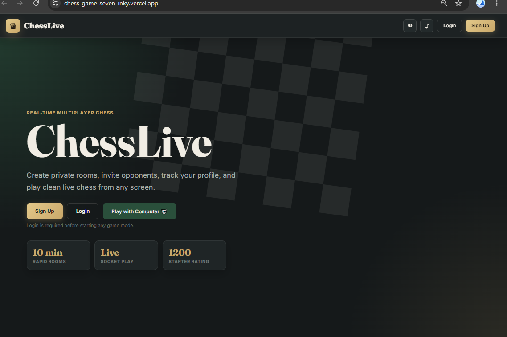
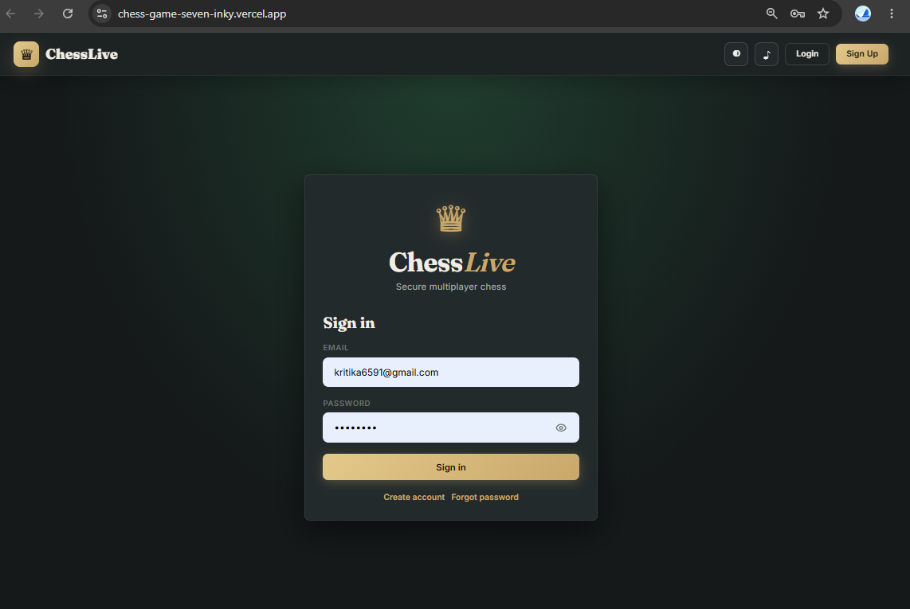
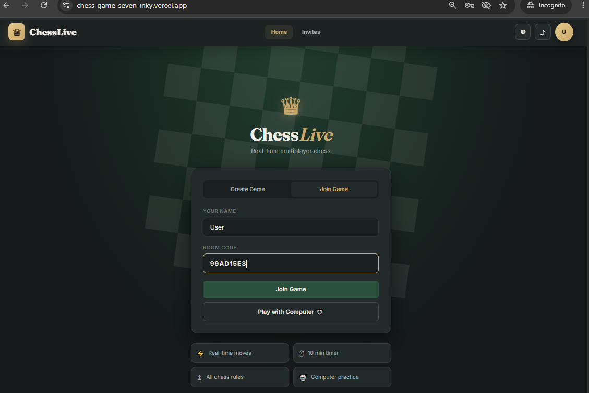
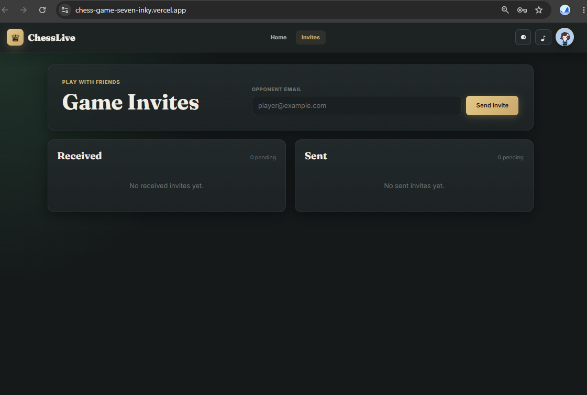
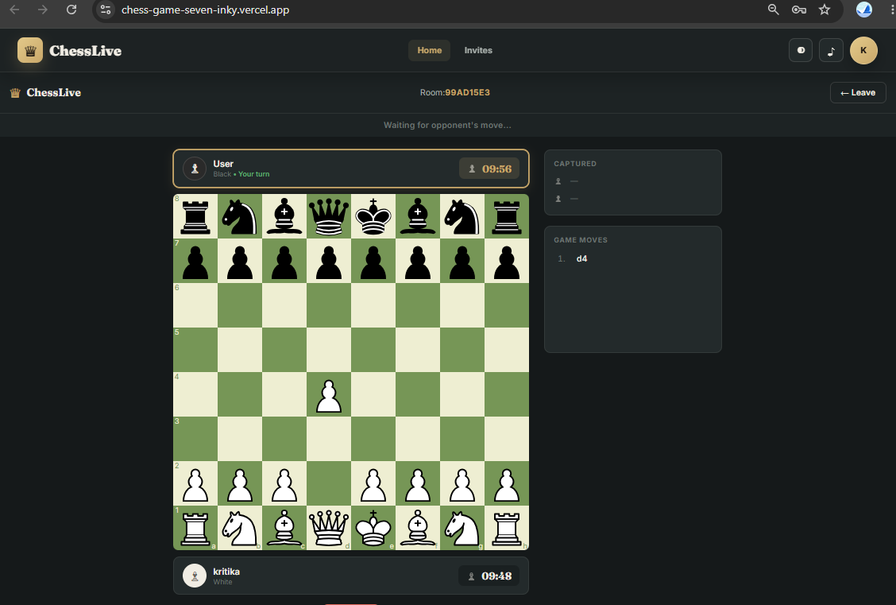
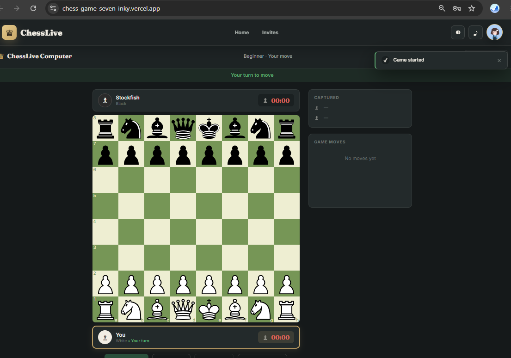
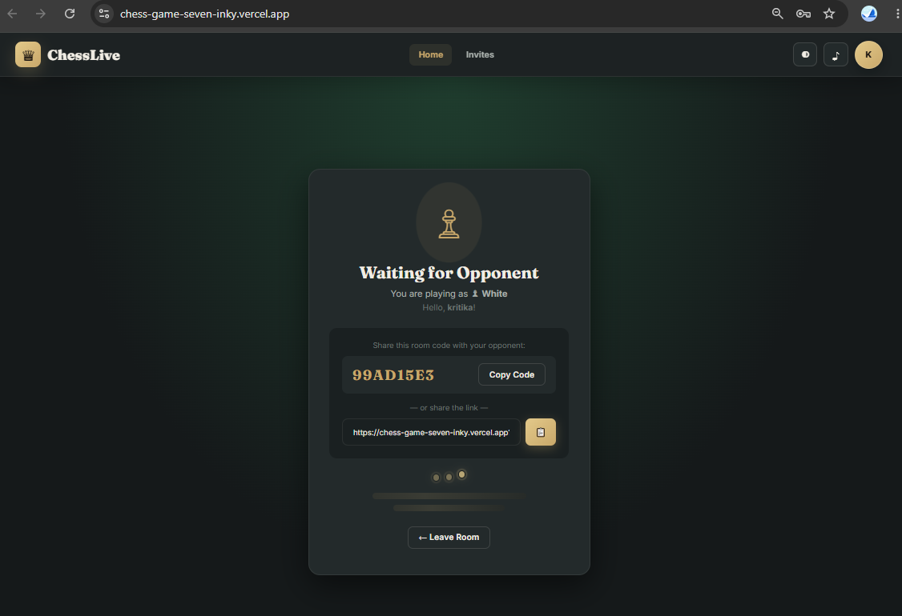
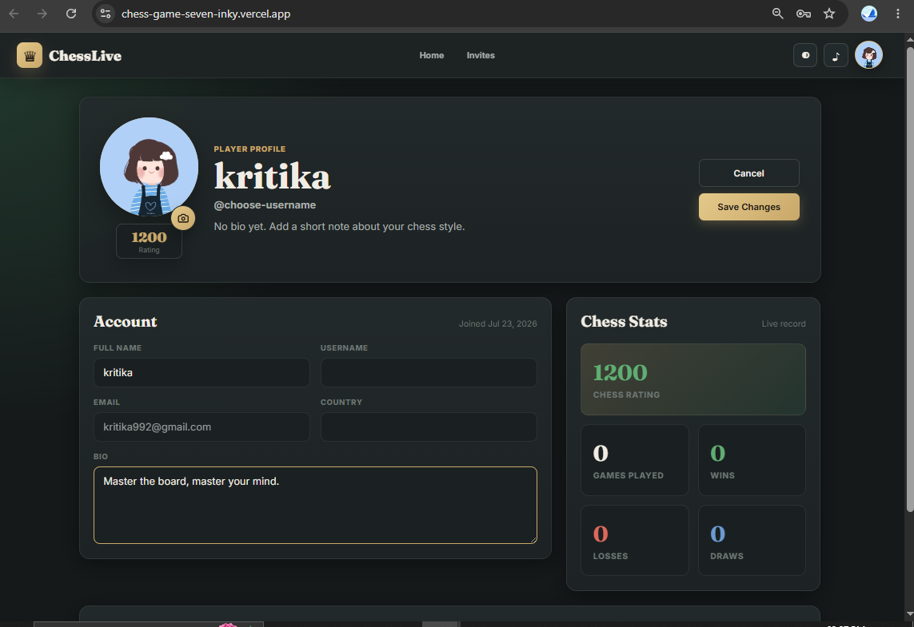

# ChessLive — Real-Time Multiplayer Chess

A full-stack real-time multiplayer chess game. React + react-chessboard on the
frontend, Node/Express + Socket.io + chess.js on the backend.

## Features

- Create a room and share a link/code with a friend, or join with a code
- Server-authoritative move validation (chess.js) — clients can't cheat
- Drag-and-drop **and** click-to-move (mobile friendly)
- Legal move highlighting, check/checkmate/stalemate/draw detection
- Pawn promotion dialog
- Move history (SAN notation), captured pieces with material count
- Per-player countdown timers (10 min default), synced from server
- Resign, rematch (with color swap), and leave-game flows
- Disconnect/reconnect handling — a dropped player can rejoin the same room
- Dark/light theme toggle, fully responsive (mobile → desktop)

## Project Structure

```
chess-game/
├── server/                 # Node/Express + Socket.io backend
│   ├── index.js             # All server logic (rooms, sockets, game state)
│   ├── package.json
│   └── .env.example
└── client/                 # React frontend
    ├── public/
    │   └── index.html
    ├── src/
    │   ├── components/      # Reusable UI pieces (board, timer, panels, modals)
    │   ├── context/          # SocketContext + GameContext (global state)
    │   ├── hooks/            # useChessSocket — all socket event wiring
    │   ├── pages/             # LandingPage, WaitingRoom, GamePage
    │   ├── styles/App.css
    │   ├── App.js
    │   └── index.js
    ├── package.json
    └── .env.example
```

## Prerequisites

- Node.js 16+ and npm

## Setup & Run

### 1. Backend

```bash
cd server
npm install
cp .env.example .env       # optional — defaults to port 3001
npm start                   # or: npm run dev (with nodemon)
```

Server runs at `http://localhost:3001`.

### 2. Frontend

In a new terminal:

```bash
cd client
npm install
cp .env.example .env       # points REACT_APP_SERVER_URL at the backend
npm start
```

App opens at `http://localhost:3000`.

### 3. Play

1. Open `http://localhost:3000` in one browser tab — enter a name, click
   **Create Game**. You'll land in a waiting room with a room code / link.
2. Open a second tab (or send the link to a friend) — enter a name, click
   **Join Game**, paste the room code (or just open the shared link, which
   auto-fills the code).
3. Once both players are in, the game starts automatically. White moves first.

## How It Works

### Backend (server/index.js)

- **Rooms** are stored in memory (`rooms[roomId]`), each holding a `chess.js`
  instance, player info, move history, captured pieces, timers, and status.
- **REST**: `POST /api/rooms` creates a room and returns an 8-character code.
  `GET /api/rooms/:id` lets the client check a room exists/has space before
  joining via socket.
- **Socket events** (client → server): `joinRoom`, `makeMove`, `resign`,
  `requestRestart`, `acceptRestart`, `reconnectToRoom`.
- **Socket events** (server → client): `roomJoined`, `roomUpdate`, `moveMade`,
  `gameOver`, `timerUpdate`, `playerDisconnected`, `playerReconnected`,
  `restartRequested`, `gameRestarted`, `error`.
- Every move is validated server-side with chess.js before the board state is
  updated and broadcast — the client's own legality check is only for UX
  (instant feedback), never trusted.
- Turn order is enforced server-side (`socket.data.color` must match
  `chess.turn()`).
- Disconnects pause that room's timer; the same player can rejoin (matched by
  name + assigned color) and resume.

### Frontend

- `SocketContext` holds a single persistent `socket.io-client` connection.
- `GameContext` (useReducer) holds all UI-relevant game state, updated purely
  from socket events via `useChessSocket`.
- `ChessBoardView` wraps `react-chessboard`: computes legal destination
  squares client-side (for highlighting) using a local `chess.js` instance
  built from the latest server FEN, but every actual move is sent to the
  server and only rendered once the server confirms it.
- Pawn promotion shows a piece-picker modal before sending the move.
- Responsive board sizing recalculates on window resize for mobile/tablet/desktop.

## Customization

- **Timer length**: change `timers: { white: 600, black: 600 }` in
  `server/index.js` (`createRoom`), in seconds.
- **Theme colors**: edit the CSS custom properties at the top of
  `client/src/styles/App.css` (`:root[data-theme="dark"]` / `"light"`).
- **Room code length**: change `.slice(0, 8)` in the `POST /api/rooms` route.

## Production Deployment Notes

- Set `REACT_APP_SERVER_URL` in the client's `.env` to your deployed backend
  URL before running `npm run build`.
- Configure CORS `origin` in `server/index.js` to your deployed frontend
  domain instead of `'*'`.
- For horizontal scaling beyond a single server process, swap the in-memory
  `rooms` object for a shared store (e.g. Redis) and use the
  `socket.io-redis` adapter so rooms work across multiple server instances.


## 📸 Screenshots

### Homepage


### Login


### Join Room


### Game Invites


### Chess Board


### Play with Computer


### Waiting Room


### Profile

